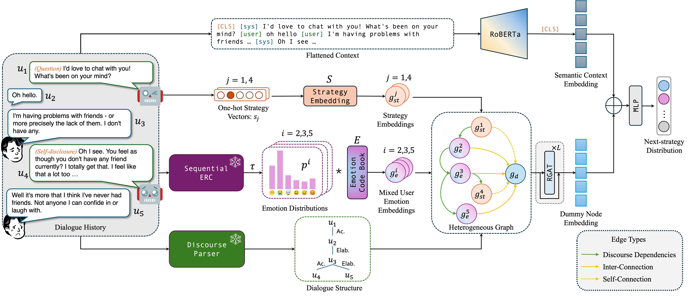

<p align="center">
  <h1 align="center">EmoDynamiX</h1>
  <h3 align="center">Emotional Support Dialogue Strategy Prediction by Modelling MiXed Emotions and Discourse Dynamics</h3>
  <h4 align="center">NAACL 2025 Oral</h4>
  <p align="center">  
    <a href="https://aclanthology.org/2025.naacl-long.81/">Paper</a>
    ·
    <a href="https://github.com/cw-wan/EmoDynamiX-v2/blob/master/Slides.pdf">Slides</a>
  </p>
</p>



## Usage

[DEMO.ipynb](DEMO.ipynb) shows an example of using EmoDynamiX. You could integrate EmoDynamiX with any LLM you like to make your own strategy-controlled ESC agent!

## Download Checkpoints

|              Model               |                                                                                        URL                                                                                        |
|:--------------------------------:|:---------------------------------------------------------------------------------------------------------------------------------------------------------------------------------:|
|       EmoDynamiX on ESConv       |                                           [link](https://drive.google.com/file/d/1pbBH5pbw5bY-35avobkdzqi0gv_bL_pn/view?usp=drive_link)                                           |
|       EmoDynamiX on AnnoMI       |                                           [link](https://drive.google.com/file/d/1VWhx9xoC7L9roSPeP9hvXjGlyjzs-kY5/view?usp=drive_link)                                           |
| Pretrained Submodules | [link](https://drive.google.com/file/d/1KNsoWp1FjdMnrCVWiONRb6w4QUpzGuyP/view?usp=drive_link) |

Unzip to the project root directory.

## Reproduce the Results

Test on ESConv:

```shell
./test_roberta_hg_esconv.sh
```

Test on AnnoMI:

```shell
./test_roberta_hg_annomi.sh
```

## Training from Scratch

Train on ESConv:

```shell
./train_roberta_hg_esconv.sh
```

Train on AnnoMI:

```shell
./train_roberta_hg_annomi.sh
```

## Citation

If you find our work useful, please cite our paper:

```bibtex
@inproceedings{wan-etal-2025-emodynamix,
    title = "{E}mo{D}ynami{X}: Emotional Support Dialogue Strategy Prediction by Modelling {M}i{X}ed Emotions and Discourse Dynamics",
    author = "Wan, Chenwei  and
      Labeau, Matthieu  and
      Clavel, Chlo{\'e}",
    editor = "Chiruzzo, Luis  and
      Ritter, Alan  and
      Wang, Lu",
    booktitle = "Proceedings of the 2025 Conference of the Nations of the Americas Chapter of the Association for Computational Linguistics: Human Language Technologies (Volume 1: Long Papers)",
    month = apr,
    year = "2025",
    address = "Albuquerque, New Mexico",
    publisher = "Association for Computational Linguistics",
    url = "https://aclanthology.org/2025.naacl-long.81/",
    pages = "1678--1695",
    ISBN = "979-8-89176-189-6"
}
```
